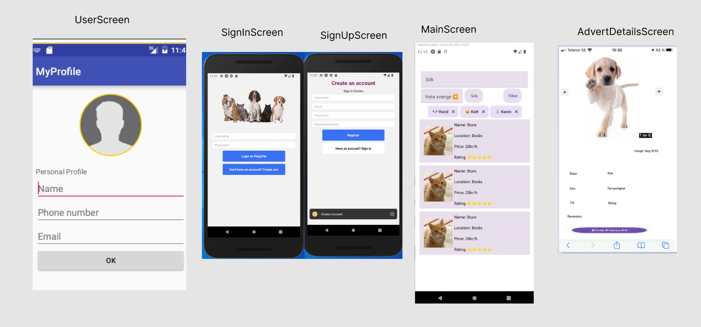
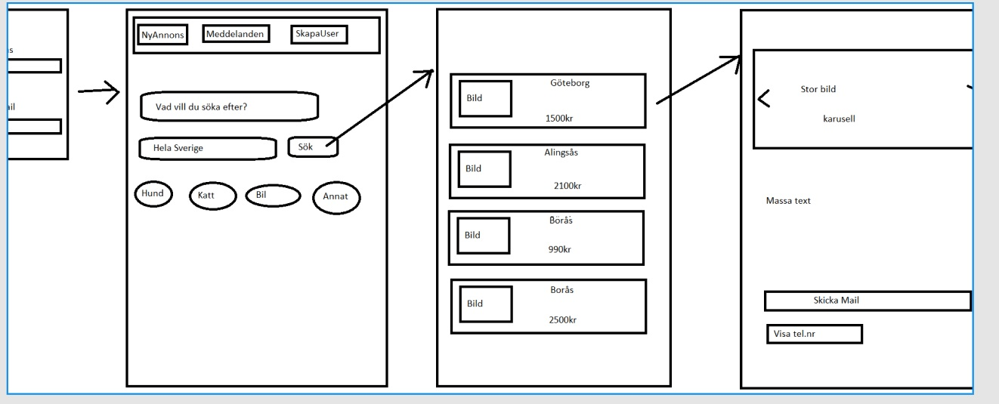
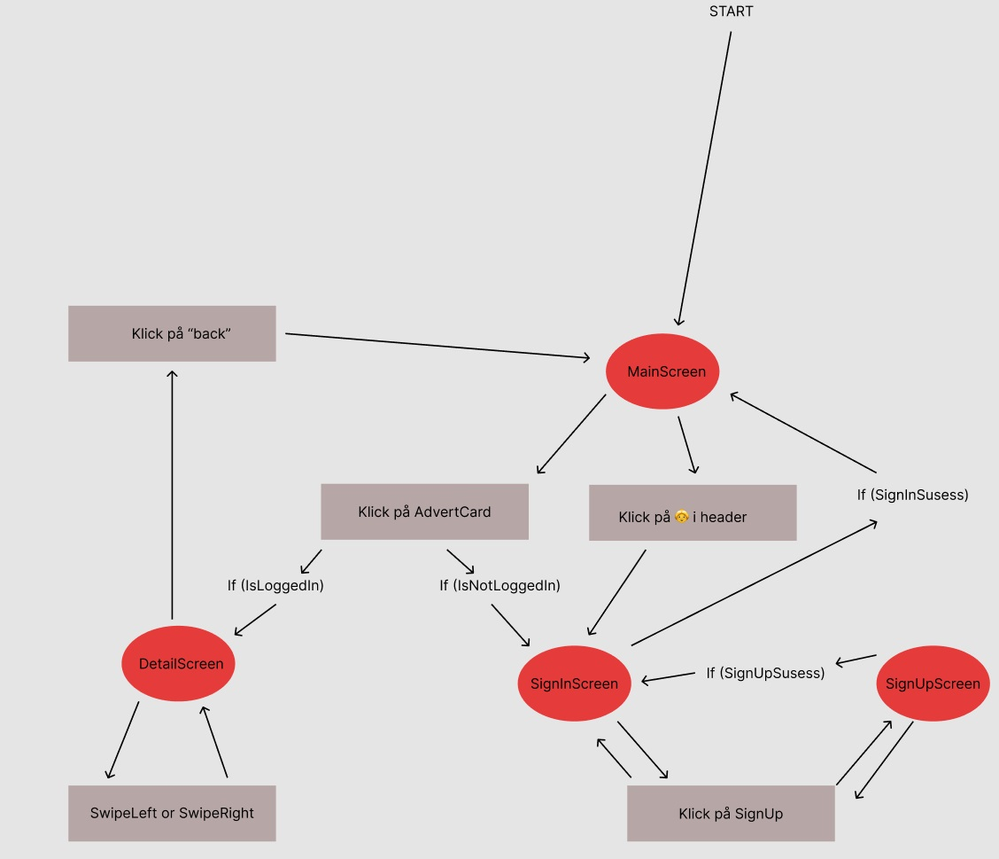

# Pet@Pet 🐶
### En app för husdjurägare som behöver tillfällig avlastning, och för folk som gärna hjälper till.

## Instruktioner för att köra projektet

#### Krav för att köra projektet är:

* node
* npm

#### Efter du har klonat ner projektet, navigera till /frontend och kör: 
```
npm i
```
#### Därefter kan du starta projektet genom att köra: 
```
expo start
```

Har du inte en emulator eller simulator installerad kan du köra appen på din fysika telefon med hjälp av expo appen, bara skanna qr-koden som kommer upp i ditt konsoll fönster

android: https://play.google.com/store/apps/details?id=host.exp.exponent 

ios: https://apps.apple.com/app/apple-store/id982107779


## Krav för inlämning

[x] - Projektet använder minst 6 stycken RN-komponenter och minst 6 stycken Expo
komponenter.

[x] - De utvalda komponenterna ska antecknas i er README tillsammans med en lista över
genomförda krav.

[x] - Git & GitHub har använts [^1]

[x] - Projektmappen innehåller en README.md fil - (läs ovan för mer info)

[x] - Uppgiften lämnas in i tid!

[x] - Muntlig presentation är genomförd

[x] - Alla punkter för godkänt är uppfyllda

[x] - React Navigation används för att skapa en bättre upplevelse i appen.

[x] - Ytterligare en valfri extern modul används i projektet.

[x] - Prototyper för applikation tas fram innan den implementeras. Bilder på prototypenskall finnas i projektet vid inlämning. [^2]

[^1]:Obs Azure har använts istället
[^2]:Länk till figma : https://www.figma.com/file/kqFWTlEwVPlTb1Nszy35Ef/Daniel-Josefsson's-team-library?node-id=0%3A1

#### Använda react native komponenter :
```
    View
    Pressable
    Image
    KeyboardAvoidingView
    ScrollView

```
#### Övriga react native imports : 
```
    Stylesheet
    useWindowDimensions
    Platform
    Backhandler
    KeyboardTypeOptions
```

#### Använda react native paper komponenter: 
```
    Card
    Switch
    Text
    Title
    Paragraph
    IconButton
    TextInput
    Button
    FAB
```

#### Övriga react native imports : 
```
    MD3LightTheme
    MD3DarkTheme
    MD3Theme
```

#### Expo moduler: 
```
    av
    haptics
    mail-composer
    sms
    speech
    status-bar
    secure-store
    flashList
```

#### Externa moduler: 
```
    react-navigation
    react-navigation/native-stack
    axios
    react-hook-form
    deepmerge
    react-native-wheel-color-picker
```

### Avgränsningar pga tid&ork: 
"Like" knappen har ingen funktionallitet, tanken var att det skulle sparas och sedan kunna filtrera listan på bara gillade annonser

Reviews ville vi implementera, något simpelt med en rating + kommentar, datum kanske. Därefter skulle ratingen/stjärnorna(grade heter det på modellen) räknas utifrån recensionerna, nu sätts bara en etta som default i backenden.

imageUrls(plural) var tänkt som en array med flera urler som man skulle kunnat swipea igenom i details sidan.

Alerts som vi använder vid formulär och andra actions kanske borde varit en snackbar istället

Race skulle vart species och det skulle finnas Chips(react native paper) för att filtrera listan på arter man vill se

CRUD på sina egna annonser.

user har duplicerade properties (email/contactEmail & alias/username) då vi från början inte ville ta data från identity databasen men vi gjorde det tillslut ändå.





